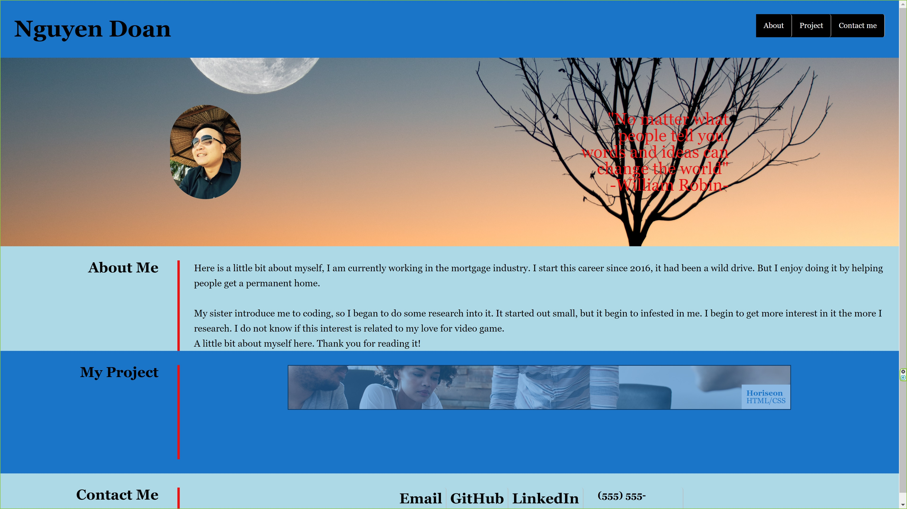

# Porfolio
#Advanced CSS Challenge - Professional Porfolio

-Page is including About Me, My Project, and Contact Info.
-Navigation links at the top of the page to take the user to any of the sections
-Recent photo of myself.
-My project show the completed work on any project/challenge that I have completed during the boot camp. Updated in the future!
-Contact me has functional email, github link, linkedin, and invalid phone number.
-The page was styled for multiple screen sizes, including tablets and mobile phones.
-Hover affects over the navigation bar, project link, and contact info.

Live link [Professional Porfolio](https://nguyendoan85.github.io/Porfolio/)

